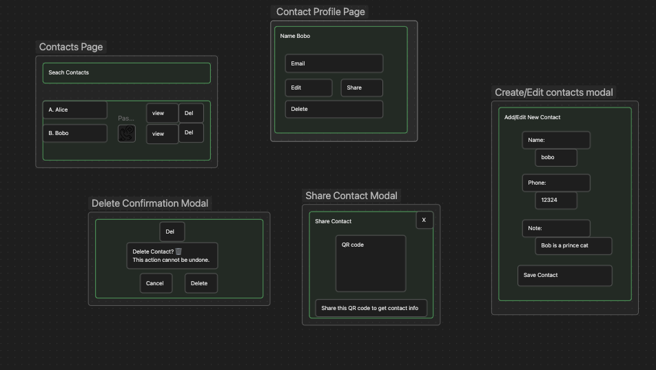

# Contact List

A full-stack contact management application built with **PostgreSQL, Express, React, and Node.js (PERN)**.

This app allows users to log in, manage their personal contacts, and perform full CRUD operations in a clean and intuitive interface.

---

## 🚀 Features

- User login (lightweight authentication)
- View all contacts
- Create a new contact
- Edit contact information
- Delete contacts
- View individual contact details
- Mark emergency contacts
- Global state management using **React Context + useReducer**

---
## Tech Stack
- Node.js
- Express.js
- PostgreSQL
- TailwindCSS


## 🗄️ Database Design

The database consists of two main tables:

### Users
- id (PK)
- name
- email

### Contacts
- id (PK)
- user_id (FK → users.id)
- first_name
- last_name
- phone_number
- email
- notes
- is_emergency_contact
- created_at

### Relationships

- One user can have multiple contacts (1:N)
- Each contact belongs to one user

## Technical Highlights



## Setup Instructions

### 1. Clone the repository
```bash
git clone https://github.com/shuwangs/contact-list-app.git

cd contact-list/server
```

### 2. Install dependencies

`npm install`

### 3. Create environment variables

Copy `.env.example` to `.env`

`cp .env.example .env`

Update the database settings.

### 4. Create database

createdb your_database_name

### 5. Restore database dump

psql -d your_database_name -f db/db_dump.sql

### 6. Start the server

`npm run dev`


## 🌱 Future Improvements
- Add search and filter functionality
- Implement full authentication (JWT or cookies)


## Author

- [Shu Wang](https://github.com/shuwangs)
